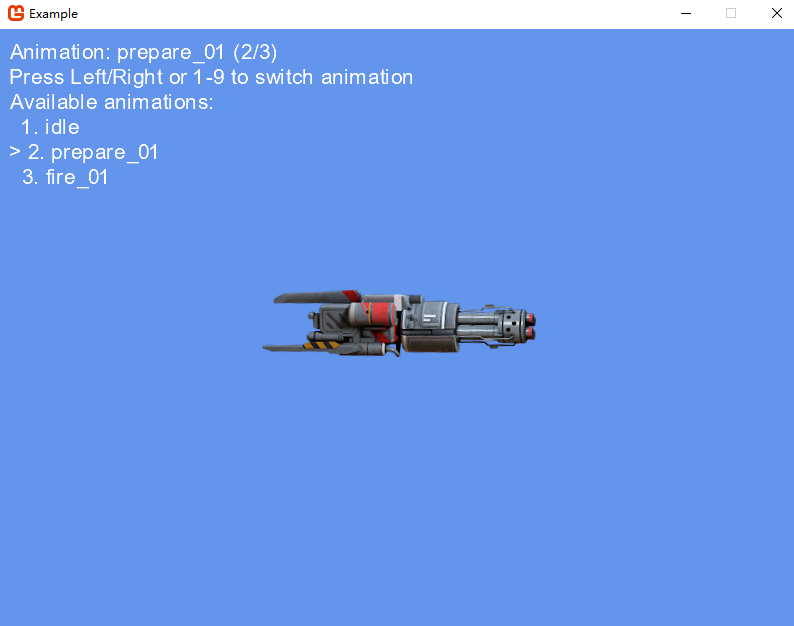

# DragonBones C# Runtime For MonoGame

Play animations using DragonBones runtime on MonoGame

### Demo

Download [Resource](https://github.com/DragonBones/Demos/tree/master/DragonBones%20Pro/Demos/weapon_1000)

Use DragonBonesPro open it and export weapon_1000_tex.png weapon_1000_ske.json weapon_1000_tex.json.

Place them in the library folder under the program resources folder.

Run it.

Don't forget runtime.[It](https://github.com/AstFast/DragonBonesCSharp.git).

